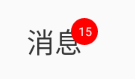

# NumberTextView
消息图标、文字消息图标
# 预览

# 资源
|名字|资源|
|-|-|
|AAR|[number_text_view.aar](https://github.com/RelinRan/NumberTextView/blob/master/number_text_view.aar)|
|Gitee|[NumberTextView](https://gitee.com/relin/NumberTextView)|
|GitHub |[NumberTextView](https://github.com/RelinRan/NumberTextView)|
# Maven
1.build.grade | setting.grade
```
repositories {
	...
	maven { url 'https://jitpack.io' }
}
```
2./app/build.grade
```
dependencies {
	implementation 'com.github.RelinRan:NumberTextView:2022.6.20.1'
}
```
# xml
~~~
    <com.androidx.wiget.NumberTextView
        android:layout_width="wrap_content"
        android:layout_height="wrap_content"
         app:numberText="10"
        android:drawableTop="@android:drawable/ic_menu_share"
        android:text="消息"/>
~~~
# attrs.xml
~~~
    <attr name="numbersTextSize" format="dimension|reference" />
    <attr name="numberMarginTop" format="dimension|reference" />
    <attr name="numberMarginRight" format="dimension|reference" />
    <attr name="numberText" format="string|reference" />
    <attr name="numberTextColor" format="color|reference" />
    <attr name="numberTextSize" format="dimension|reference" />
    <attr name="numberSolidColor" format="color|reference" />
    <declare-styleable name="NumberTextView">
        <attr name="numberMarginTop" />
        <attr name="numberMarginRight" />
        <attr name="numberSolidColor" />
        <attr name="numberTextColor" />
        <attr name="numberTextSize" />
        <attr name="numberText" />
    </declare-styleable>
~~~
